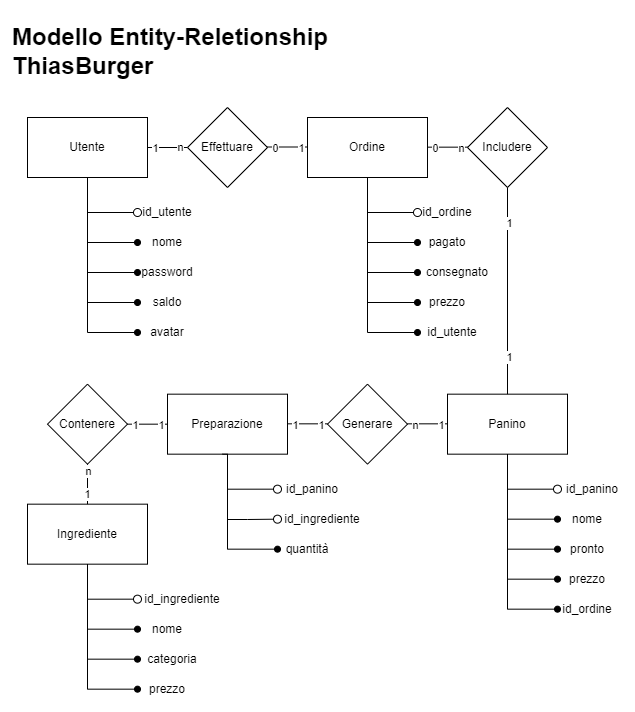
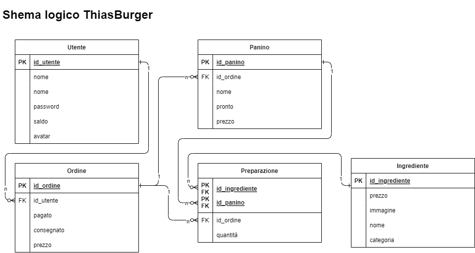

# Site for ThiasBurger

*Voglia di un panino diverso dal solito? Prova **Thiasburger**! Panini **gourmet** caldi e preparati a mano, a prezzi abbordabili.*

## Struttura del lavoro
L'intera struttura del sito si basa sul pattern **M**odel **V**iew **C**ontrol.
- **M**odel si occupa della *gestione di dati e veariabili* sia in lettura che in scrittura: in pratica, in base agli input ricevuti, il Model si occupa di *modificare lo stato del programma*. Nel nostro caso, la sezione Model si è occupata di progettare e realizzare:
    - il **database** su cui il programma va ad appoggiarsi per memorizzare *ingredienti, ordini, panini* e *utenti* che richiedono gli ordini
    - le varie **classi** su cui si appoggia l'intero programma
    - l'**interazione** tra classi e database
- **V**iew è la "facciata" del programma, ovvero ciò che si presenta alla vista degli utenti. Ciò che è visibile cambia in base ai cambiamenti di stato del Model. Nel nostro caso, la sezione View si è occupata di: 
    - inserire testo qui
- **C**ontrol è la parte di gestione degli input prima che questi possano raggiungere il model. Questo accade sia per praticità, sia per separare la sezione input dalla parte gestionale, in modo che, qualora venisse inserito un input potenzialmente dannoso, questo possa essere controllato e fermato in tempo. Nel nostro caso, il Control si è occupato di: 
    - gestire la **navigazione** dirottando l'utente tra le diverse pagine
    - gestire i **dati degli ordini** dell'utente e passarli al Model
    - utilizzare il Model per ottenere dati da ritornare alla View sotto forma di **json**

#### Modello Entity-Reletionship 

    

#### Schema Logico 

    

